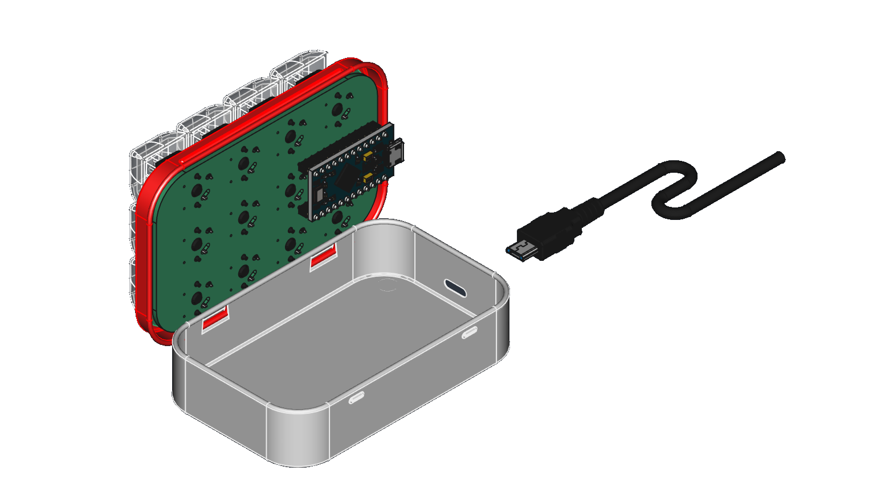
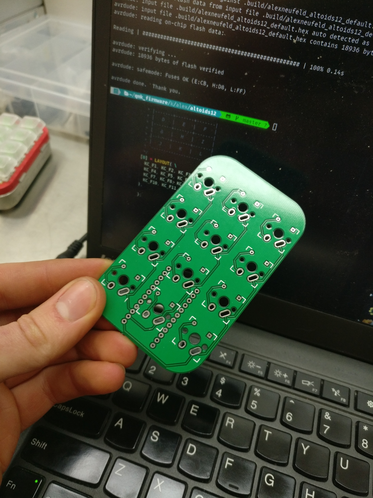
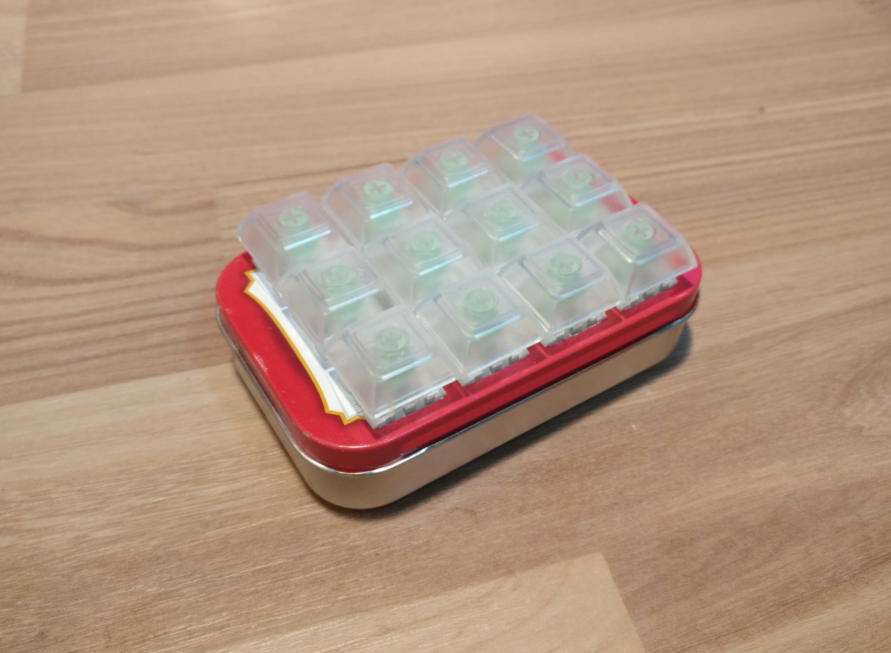
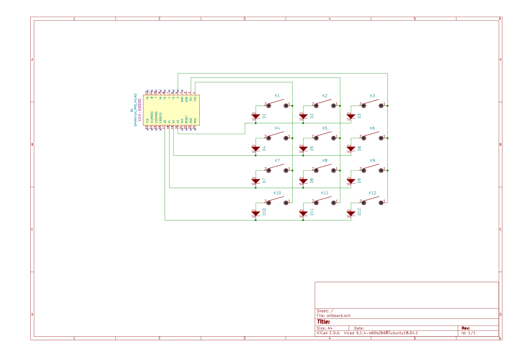

# 12 Key Altoids Tin MacroPad

By Alex Neufeld, 2021

### Features:
- 12 cherry style mechanical keyswitches
- Custom PCB
- QMK firmware via a Sparkfun Pro Micro clone

### Building

The design files as available in this repo. I don't have a formal build guide, sorry. 

If you just want to get some PCBs made, there is a gerber .zip file in the `pcb` directory.

I cut the top of the case with a cutoff wheel in a rotary tool. There is a printable template in the `case` directory that I attached with spray adhesive and cut through.

Quick note on the firmware side of things: QMK is very new to me. the `firmware` directory has a proof of concept fileset that was enough to get a basic keymap onto my board. You're on your own if you want to add fancier features (layers, etc.) 

### BOM

| Part      | Quantity | Example source                                           |
|-----------|----------|----------------------------------------------------------|
| Case      | 1        | [LINK](https://www.amazon.com/dp/B07GG67NNH/)            |
| Switches  | 12       | [LINK](https://www.aliexpress.com/item/32862816873.html) |
| Keycaps   | 12       | [LINK](https://www.aliexpress.com/item/32830177884.html) |
| Pro Micro | 1        | [LINK](https://www.aliexpress.com/item/32768308647.html) |
| Diodes    | 12       | [LINK](https://www.digikey.ca/short/m5v7m70m)            |

### Gallery

CAD design

3D printed plate, the mint tin sheet metal is too thin to securely hold the switches.

PCB ready to go.

Testing with the Pro-Micro clone.

Upper assembly soldered and ready.

Add felt pads to the bottom of the case.

Steel plate for inertia, kapton tape to insulate the electronics from contact with metal parts.

Finished! rear view with cutout for USB-in.

Kailh box jade switches and clear, blank PBT keycaps installed.

### Schematic

## Acknowledgments

This project was inspired in part by the [2% milk keyboard.](https://github.com/Spaceman/SpaceboardsHardware/tree/master/Keyboards/2%25%20Milk)

Ruiqi Mao's [Keyboard PCB guide](https://github.com/ruiqimao/keyboard-pcb-guide#production) was very helpful.
